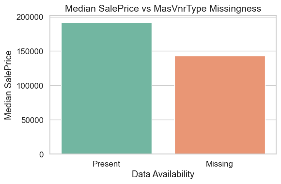
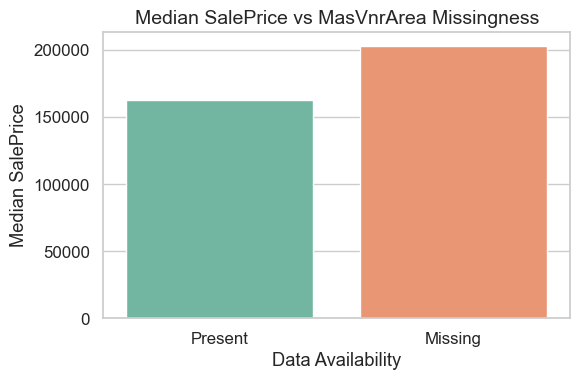
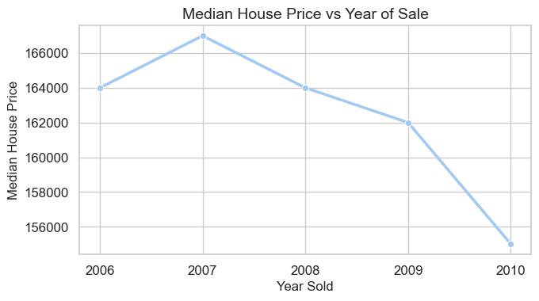

# Real Estate House Price Predictions

#### Dataset to downloaded from the below link
[Kaggle Dataset](https://www.kaggle.com/c/house-prices-advanced-regression-techniques/data)

## Building Machine Learning Pipelines: 
Machine learning piplelines helps each lifecycle of a Data Science project to run independently. It links all the lifecycles.

## All the Lifecycle In A Data Science Projects
1. Exploratory Data Analysis (EDA)
2. Feature Engineering
3. Feature Selection
4. Model Building
5. Model Deployment

--------

## Exploratory Data Analysis (EDA) Phase

#### In EDA We will Analyze To Find out the below
1. Missing Values
2. All The Numerical Variables
3. Distribution of the Numerical Variables
4. Categorical Variables
5. Cardinality of Categorical Variables
6. Outliers
7. Relationship between independent and dependent feature(SalePrice)

### Missing values:

``` python
import seaborn as sns
import matplotlib.pyplot as plt

sns.set(style="whitegrid", palette="pastel", font_scale=1.1)  # Aesthetic styling

for feature in features_with_na:
    data = dataset.copy()
    
    # Create an indicator variable for missing values
    data[feature] = np.where(data[feature].isnull(), 1, 0)
    
    # Create a temporary DataFrame with median SalePrice by missing indicator
    grouped = data.groupby(feature)['SalePrice'].median().reset_index()

    # Convert 0/1 to readable labels
    grouped[feature] = grouped[feature].map({0: 'Present', 1: 'Missing'})
    
    # Seaborn barplot
    plt.figure(figsize=(6, 4))
    sns.barplot(data=grouped, x=feature, y='SalePrice', palette='Set2')
    plt.title(f"Median SalePrice vs {feature} Missingness", fontsize=14)
    plt.ylabel("Median SalePrice")
    plt.xlabel("Data Availability")
    plt.tight_layout()
    plt.show()

```
### Results:




Here With  the relation between the missing values and the dependent variable is clearly visible.
As sometime, the missing values correspond to higher sales price. So We need to replace these NaN values with something appropriate in Feature Engineering Section

### Numerical Variables

#### Type-1: Continous variables

The numerical variables will also include Id's and temporal Vairables (ex: Datetime variables)

```python
# Grouping and resetting index to use seaborn
yearly_price = dataset.groupby('YrSold')['SalePrice'].median().reset_index()

# Plotting with seaborn
plt.figure(figsize=(7, 4))
sns.lineplot(data=yearly_price, x='YrSold', y='SalePrice', marker='o', linewidth=2.5)

# Enhancing plot details
plt.xlabel('Year Sold', fontsize=12)
plt.ylabel('Median House Price', fontsize=12)
plt.title("Median House Price vs Year of Sale", fontsize=14)
plt.xticks(yearly_price['YrSold'].unique())  # Ensure all years appear on x-axis
plt.tight_layout()
plt.show()

```



There is a peak in 2007 for sale price of houses and an extreme drop towards the end of 2010.

```python
for feature in year_feature:
    if feature != 'YrSold':
        data = dataset.copy()

        # Difference between year feature and year the house was sold
        data[feature + '_diff'] = data['YrSold'] - data[feature]

        plt.figure(figsize=(7, 4))
        sns.scatterplot(data=data, x=feature + '_diff', y='SalePrice', edgecolor=None)

        plt.xlabel(f'{feature} Difference (YrSold - {feature})', fontsize=12)
        plt.ylabel('SalePrice', fontsize=12)
        plt.title(f'SalePrice vs {feature} Difference', fontsize=14)
        plt.tight_layout()
        plt.show()

```


From the above scatter plot, we can say recently built houses have higher median sale price compared to older ones as there is almost an exponential decrease.

#### Type-2: Discrete variables

``` python
for feature in discrete_feature:
    data = dataset.copy()
    
    # Calculate median SalePrice for each category
    grouped = data.groupby(feature)['SalePrice'].median().reset_index()

    # Sort by feature value if it's numeric, else leave as is
    plt.figure(figsize=(7, 4))
    sns.barplot(data=grouped, x=feature, y='SalePrice', palette='Set3')

    plt.xlabel(feature, fontsize=12)
    plt.ylabel('Median SalePrice', fontsize=12)
    plt.title(f'Median SalePrice vs {feature}', fontsize=14)

    plt.tight_layout()
    plt.show()
```

### Results


The above plots show the variation of Salesprice for each categorical features, unique features.

In this plot, there is an exponential increase in median sale price of house with overall quality of house ranging from 1-10.

### Continous Variable

``` python
continuous_feature=[feature for feature in numerical_features if feature not in discrete_feature+year_feature+['Id']]   # Concatinating the list
print("Continuous feature Count {}".format(len(continuous_feature)))

for feature in continuous_feature:
    data = dataset.copy()
    
    plt.figure(figsize=(7, 4))
    sns.histplot(data[feature], bins=25, kde=True, color='skyblue', edgecolor='white')

    plt.xlabel(feature, fontsize=12)
    plt.ylabel("Count", fontsize=12)
    plt.title(f'Distribution of {feature}', fontsize=14)
    plt.tight_layout()
    plt.show()
```

### Results


This is a right skewed histogram, we have to make it a normal distribution so that the ML algorithm could yield better results.

### Outliers

``` python
for feature in continuous_feature:
    data = dataset.copy()
    
    # Skip features with 0 values to avoid log(0)
    if 0 in data[feature].unique():
        continue
    else:
        data[feature] = np.log(data[feature])

        plt.figure(figsize=(4, 4))
        sns.boxplot(y=data[feature], color='skyblue')

        plt.ylabel(f'Log of {feature}', fontsize=12)
        plt.title(f'Boxplot of Log({feature})', fontsize=14)
        plt.tight_layout()
        plt.show()
```

### Results


